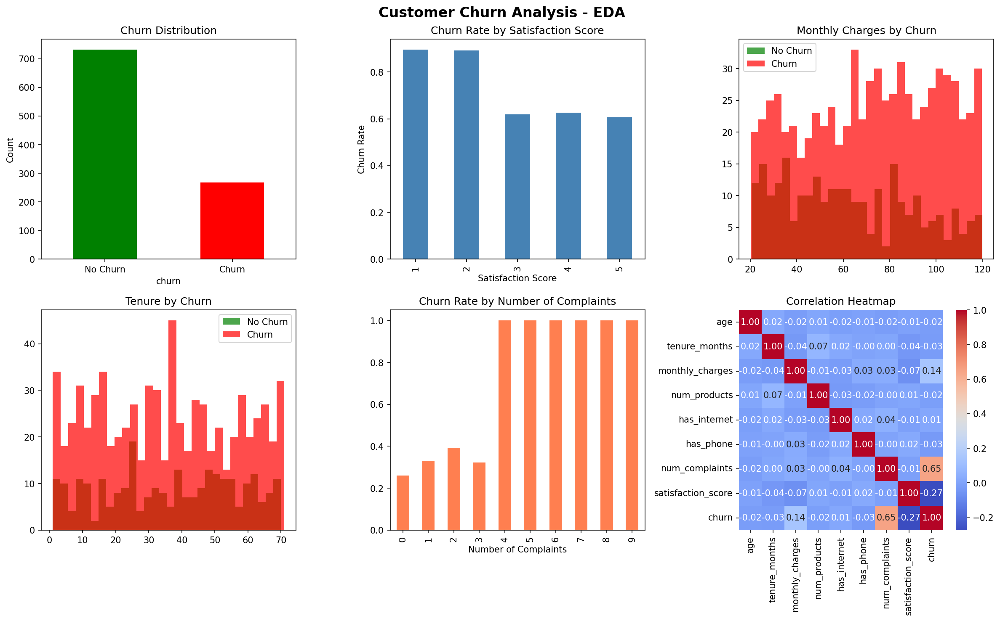
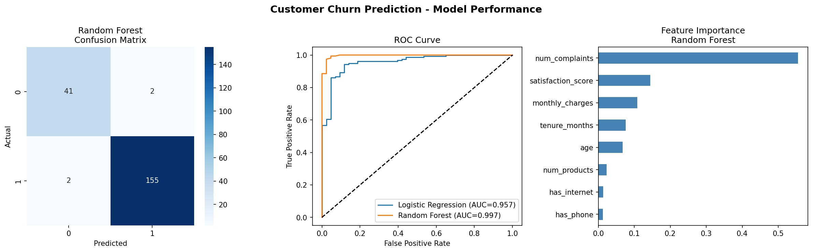

# Customer Churn Prediction

Machine learning pipeline to predict customer churn using demographic and behavioral data. Helps businesses identify at-risk customers and take proactive retention actions.

## Features
- EDA with churn distribution, satisfaction analysis, complaints analysis
- Data visualizations: correlation heatmap, feature distributions
- ML models: Logistic Regression (92% accuracy) and Random Forest (98% accuracy)
- ROC Curve, Confusion Matrix, Feature Importance analysis

## Key Findings
- Number of complaints is the strongest predictor of churn
- Satisfaction score and monthly charges are next most important
- Random Forest AUC = 0.997

## Tech Stack
Python, Pandas, NumPy, Matplotlib, Seaborn, Scikit-learn

## Visualizations

